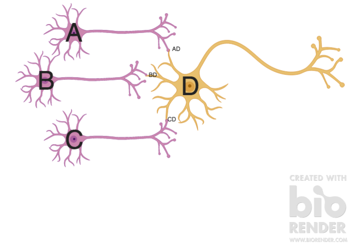

# Spiking technology notation 

To extend previously started article:
https://www.overleaf.com/19697776yqzdttfnhwmq

Spiking memristive neurons have functions:

1. Threshold
1. Learning (STDP (Δt))
1. Integration (ex., inh.) in timeframe (Leakage)
    1. probabilistic
	1. temporal
	1. logic

## Notation

```
\ - earlier
/ - later
| - same time

* - conjunction
+ - disjunction
! - inhibition
> - implication 
```

## Examples 





```
A| * B > C = if A and B at the same time then C

A:0.5| * B:0.5 > C:0.25 = if A with probability 0.5 and B with probability 0.5 at the same time then C has probability 0.25

A:0.5\1 * B:0.5 > C:0.1 = if A with probability 0.5 is 1ms earlier B with probability 0.5 then C has probability 0.1 (because of leakage)

A:0.5\10 * B:0.5 > C:0.0 = if A with probability 0.5 is 10ms earlier B with probability 0.5 then C has probability 0.0 (because of leakage)

A\1 * B\0.1 * C > D = if A 1 ms earlier than B and B 0.1 ms earlier than C then D

A| * !B > C:0 = if A and B at the same time and B is inhibiting A then probability of C is 0.0

```

## Weights 

Weight is the maximum value of a synapse(input channel) to influence the probability of a neuron to fire an outbound spike.

If there is inbound spike of the neuron A to the neuron B and the synapse AB has the weight of W:

```
Bayes:
P(AD|A) = P(A|AD)P(AD)/P(A)

P(AD) = P(max(g(AD)))
Distribution of P(AD): Gaussian or Poisson
g = conductance of the synapse AD or the width of probability channel.
Conductance could be understood as influence of the synapse over neuron to fire the outbound spike.
P(D) = П P(iD) where i stands for inbound neuron in corresponding synapse in a leakage timeframe.
```

## Learning 

The update of g_i according to STDP (Δt).
The higher is g of a synapse the higher is the influence of this synapse over the probability of the neuron to fire outbound spike, the lover is g the less is the influence over the neuron's probability to fire the outbound spike.

```
g = Σ Δw 
Δw = 1/Δt (Hebbian learning function)
Δw = |1/Δt| (Sombrero learning)
Δw = -1/Δt (anti-Hebbian learning)
Δw = -|1/Δt| (anti-Sombrero learning)

```
g is the width of the possible values of the influence over the membrane potential to reach threshold and as the result to fire an outbound spike.
Thus g influences the μ mean value of the normal Gaussian distribution. Taking in account the probability density of the normal distribution:

```
μ = g/2
```
