# Memristive brain project technical approach
How to make a machine "feel" emotions?

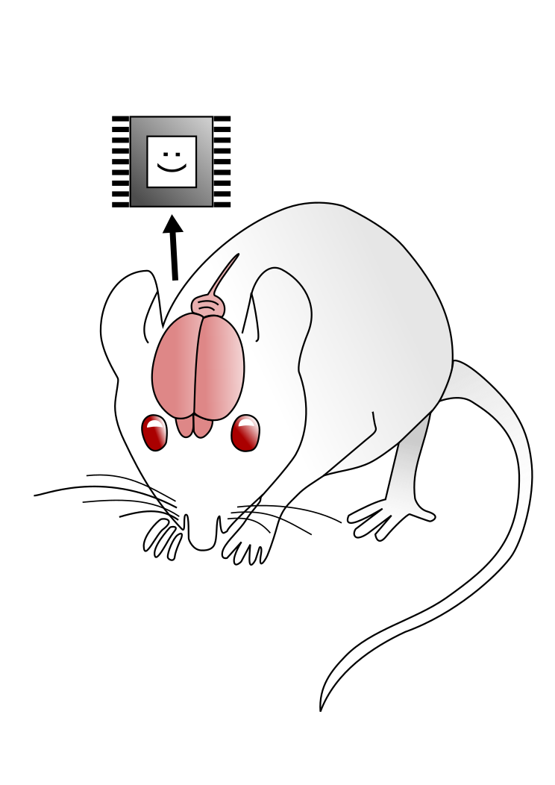

## Problem

Affects, emotions play crucial role in mammalian life including human life. Starting from Darwin researchers pay attention to emotional mechanisms of animals with special attention in psychology to emotions of humans. Currently it is clear that consciousness and human intelligence is not possible without emotions and emotions related mechanisms please refer to works of Antonio Damasio. This way the cornerstone of artificial intelligence and what it is missing for better social collaboration could be emotions and emotional drives system.

Because  the neuromodulation is the biological basement of emotional mechanisms especially taking in account neuro-psychological model: ["cube of emotions"](https://en.wikipedia.org/wiki/L%C3%B6vheim_cube_of_emotion) and roles of dopamine (DA), serotonin (5-HT), noradrenaline (NA). To implement neurobiological mechanisms and drives within bio-plausible approach we have to start with most basic functionality of neuromodulation in neuron. We have used the memristive approach as a memristive device could be understood as electronic analog of synapse and already it was indicated that silicon and polyaniline memristors are capable of STDP or basic neuronal learning.

## Road map 

## Neuron

We have created and implemented the following schema of modulating, inhibitory, excitatory neuron.

There are three parts of the block diagram represented in colors: excitatory – orange, inhibitory – blue, modulatory – green. Inputs are depicted as triangles. The excitatory learning is implemented via *ExLTP[1..ne]* and *ExLTD[1..ne]* feedback loops of excitatory memristive device (*Ex[1..ne]*), where LTP (long term potentiation) blocks implement the learning function above x axis (*eSTDP* graph) and LTD (long term depression) blocks implement learning function below x. *Generator 1* and *Generator ne* implement dendrite spikes. The *Blocking leaky integrator* implements a dendrite joint where first dendrite spike blocks second close one due to NA/K channels refractory dynamics.

The inhibitory part has different structure, where the LTP is implemented as feedback loop block that uses inbound pre-synaptic signals and outbound of memristive device signals. The LTD is implemented as feedback from neuron outbound signal. The LTP and the LTD implement learning function described in Hennequin et al.(2017) indicated as *iSTDP* graph. Modulatory blocks *Mod[1..m]* influence LTP and LTD functional blocks modulating the amplitude of learning impulses. The modulation influence over STDP is presented via *meSTDP* graph. *Integrator*, *Threshold adder* and *Generator* are the implementation of a neuronal soma and axon hillock that integrates excitatory and inhibitory inbound signals and generates the outbound signal.

## Cortical column 

### Nucleus

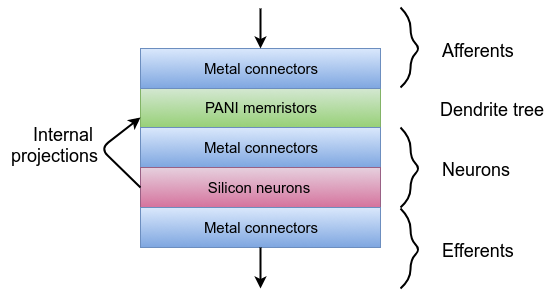

### 1 layer

The next step from neuron is a cortical column (approximately 104 neurons with 108 synapses) that could be understood as basic functional structure of neocortex.

The design starts from one layer approximately (2\*104 neurons and 2\*108 synapses) of a cortical column, the block diagram is presented below:

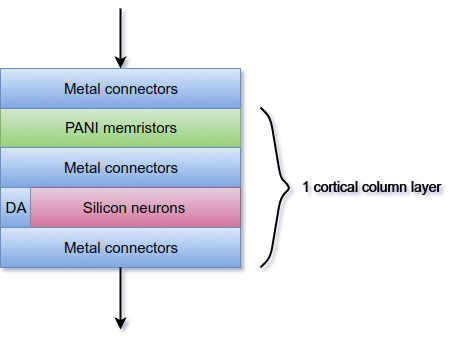

The inbound signal is transmitted via *Metal connectors* see Tsai(2015) to layer of *PANI memristors* (PANI stands for polyaniline) that are stochastically organized Fontana(2011) and connected with neuromodulatory *Silicon neurons* described [above](#neuron) via *Metal connectors*. *Metal connectors* and *Silicon neurons* are created via modern lithography while *PANI memristors* technology should be clarified. Outbound projections are created via lover layer of *Metal connectors*.

### 1 layer 3D structure

The three dimensional structure of memristive cortical column is presented below:

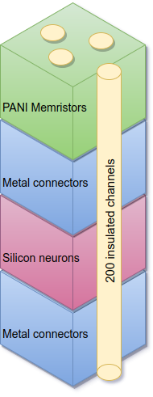

Running through projections are organized via insulated channels to the *PANI memristors* layer.

#### Quantitative parameters

Component | Parameter | Value
--:| --:| :--
PANI memristors | Synapse | 2\*108
Metal connectors | Connector | 2\*108
Silicon neurons | Neuron | 2\*105

### Minimalistic implementation

A minimalistic feed forward cortical should have following structure where each component is the 1 layer component presented [above](1-layer):

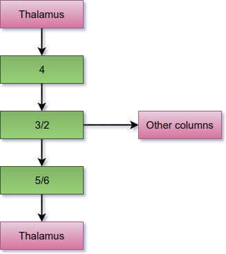

The biological 4th layer is inbound for thalamic projections. The 4th layer structure is presented in [1 layer](1-layer) section while all the rest are missing first *Metal connectors* component. The 4th layer component has excitatory projections mainly to *3/2* layers. *3/2* layers are have efferent projections to other layers and *5/6* layers, that in their turn have efferent projections to the thalamus. The number of neurons per each layer is presented in section [Bio-plausible implementation](https://github.com/research-team/memristive-brain/blob/master/doc/memristive-brain_technical_roadmap.md#bio-plausible-implementation)

### Bio-plausible implementation

Simplified bio cortical column projections are presented on the diagram below Feldmeyer(2012):

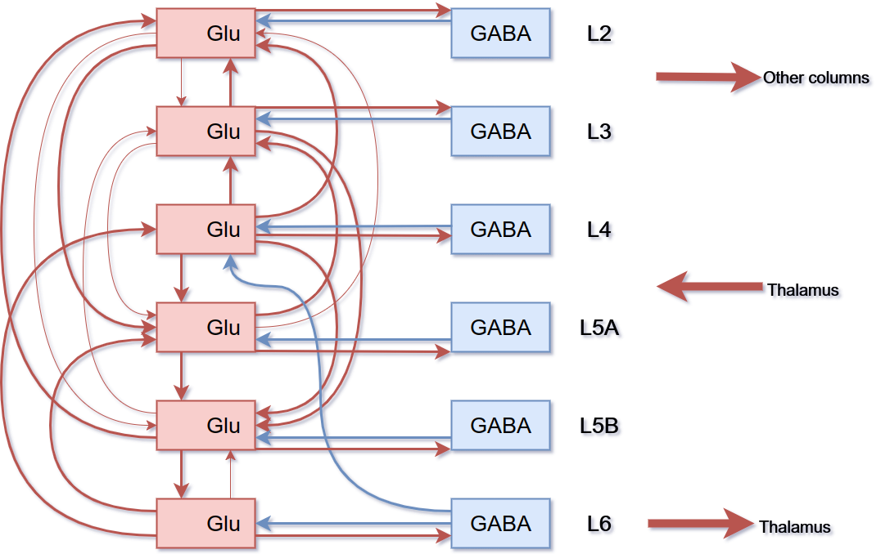

*Glu* - are the glutamate projections that are excitatory 
*GABA* - gamma-Aminobutyric acid inhibitory projections mainly internal to cortical column layer except for 6->4 inhibitory projections. 

The inbound thalamic projections come to the 4th layer, outbound are from 2nd and 3rd layers to other cortical columns, and from 6th to thalamus.

The implementation could be organized as 3D structure, where 4th layer projects to *5A*, *3* via electrical contact to their *PANI memristors* components and projects to *5B*, *2* via 3D memristive channels. 

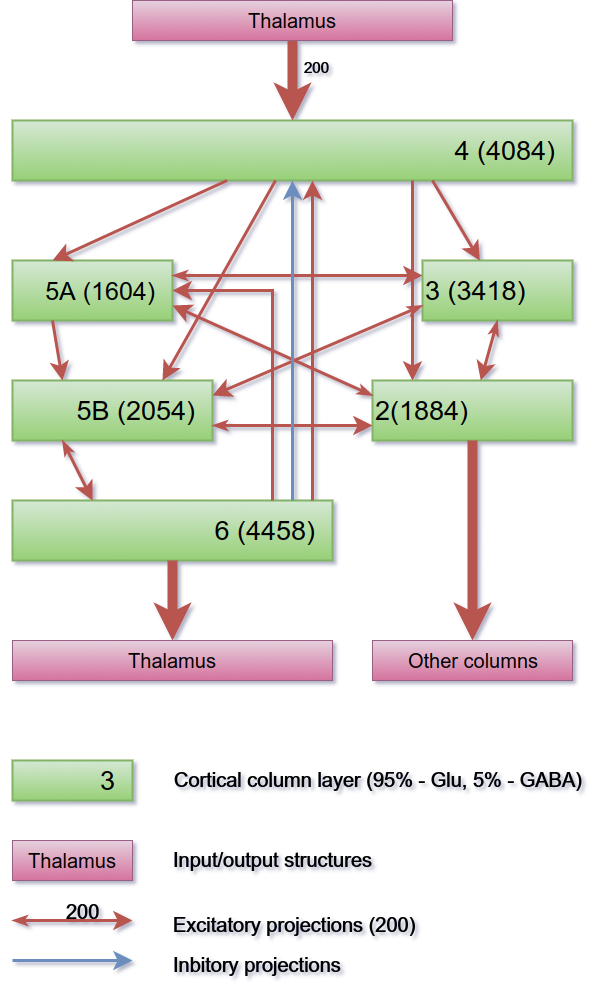

The number of neurons are inherited from Meyer(2010).

Thalamus has approximately 200 efferent projections to 4th layer of the cortical column that contains approximately 4084 silicon neurons. The 4th layer projects to 2, 3, 5A and 5B layers. The 6th layer has positive and negative feedback loops to the 4th layer and positive to the 5A. The 2nd layer has more projections to the 5A with less feedback, the 3rd has more projections to the 5B with less feedback, while the 5A has stronger projections to the 3rd layer and the 5B to the 2nd. Seems to be common pattern that the 2nd and the 3rd layer have stronger "crossing" projections to the 5A and the 5B while the 5A and the 5B have "direct" projections to the 3rd and the 2nd. Similar to the [minimalistic implementation](https://github.com/research-team/memristive-brain/blob/master/doc/memristive-brain_technical_roadmap.md#minimalistic-implementation) the 3rd layer has efferent projections to other columns and the 6th has efferent projections to the thalamus.

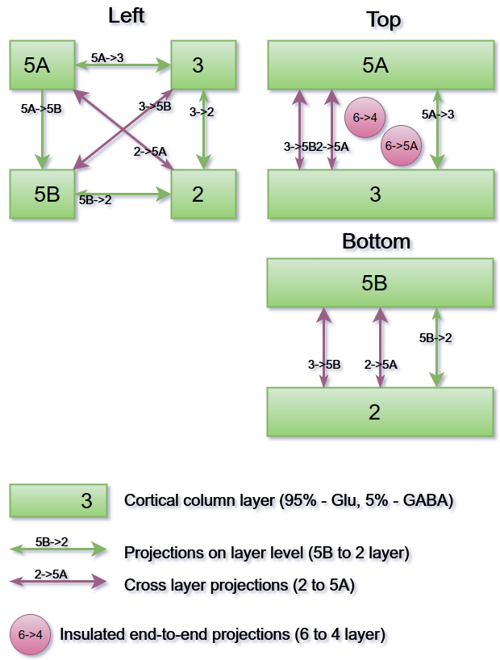

The 3D structure of projections is demonstrated above, limited to one-layer projections are depicted via green arrows, lilac arrows depict cross layer projections thus electrical connections. Projections from 6th and 4th layer are depicted via lilac circles, that are created as indicated in section [3D structure](memristive-brain_technical_roadmap.md#1-layer-3d-structure)

## Cortical and sub-cortical structures

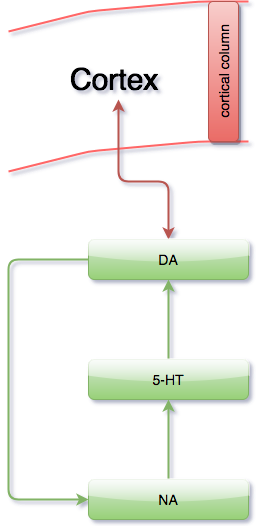

Cortical areas are organized according to principles discussed earlier analogous to biological cortical columns Mountcastle (1978). The DA, 5-HT, NA subsystems are integrated with cortex via several pathways and neuronal activity is modulated via DA, 5-HT, NA. Subcortical areas usually have similar layered structure as the cortex thus could be constructed in a similar way as described above. 
Cortex is connected with DA pathways via thalamocortical projections that are modulated via the striatum and level of the DA produced by substantia nigra pars compacta. The DA subsystems are modulated, mainly inhibited by the 5-HT subsystems and both of them are modulated via NA subsystems. The DA subsystem has feedback loop with NA subsystem. Overall we could reimplement emotional drives via reimplementing emotional involved subsystems starting from the DA as most simple to implement technically.

### Dopamine pathways

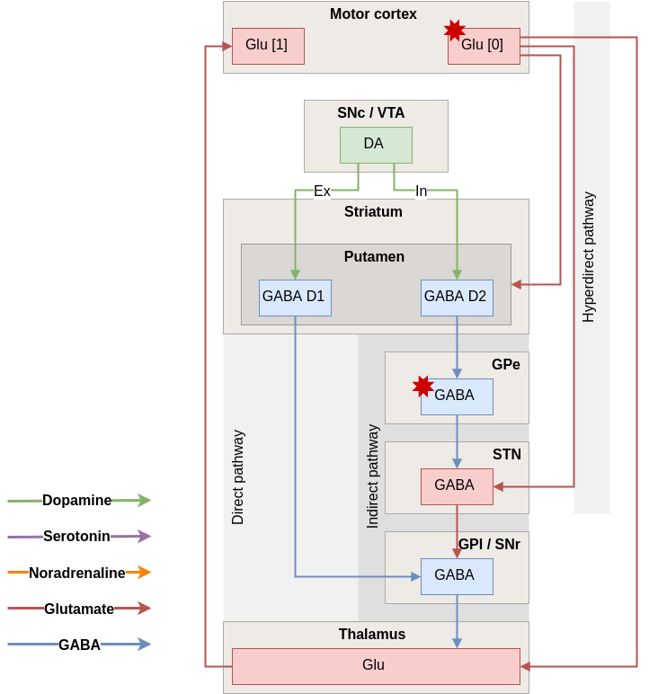

The approximate principal schema of the dopaminergic nigrostriatal, mesolimbic and mesocortical pathways is presented above.

Connectivity diagram showing excitatory glutamatergic pathways as red, inhibitory GABAergic pathways as blue, and modulatory dopaminergic pathways as green. (Abbreviations: GPe: globus pallidus external; GPi: globus pallidus internal; STN: subthalamic nucleus; SNc: substantia nigra compacta; SNr: substantia nigra reticulata)

#### Direct pathway

**Motor cortex** (stimulates) → **Striatum** (inhibits) → **"GPi/SNr" complex** (less inhibition of thalamus) → **Thalamus** (stimulates) → **Motor cortex** (stimulates) → **Muscles, etc.**

#### Indirect pathway

**Motor cortex** (stimulates) → **Striatum** (inhibits) → **GPe** (less inhibition of STN) → **STN** (stimulates) → **"GPi/SNr" complex** (inhibits) → **Thalamus** (is stimulating less) → **Motor cortex** (is stimulating less) → Muscles, etc.

The antagonistic functions of the [direct](#direct-pathway) and [indirect](#indirect-pathway) pathways are modulated by the **substantia nigra pars compacta (SNc)**, which produces **dopamine**. In the presence of dopamine, *D1*-receptors in the basal ganglia stimulate the GABAergic neurons, favoring the direct pathway, and thus increasing movement. The GABAergic neurons of the indirect pathway are stimulated by excitatory neurotransmitters acetylcholine and glutamate. This sets off the indirect pathway that ultimately results in inhibition of upper motor neurons, and less movement. In the presence of dopamine, *D2*-receptors in the basal ganglia inhibit these GABAergic neurons, which reduces the indirect pathways inhibitory effect. **Dopamine therefore increases the excitatory effect of the direct pathway (causing movement) and reduces the inhibitory effect of the indirect pathway (preventing full inhibition of movement)**. 

### Serotonin pathways

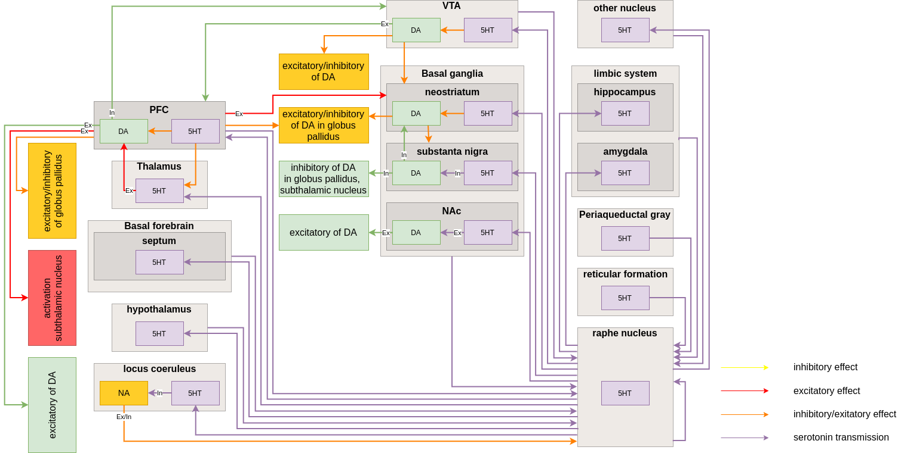

The diagram presented above depicts the overall modelled structure of the serotonin pathways. Efferent projections from the rostral group to raphe nucleus (RN), cerebral cortex, thalamus, basal forebrain (includes septum), hypothalamus, locus coeruleus, ventral tegmental area (VTA), limbic system (includes hippocampus, amygdala), basal ganglia, such as neostriatum, substanta nigra (SN) and nucleus accumbens (NAc), also to other nucleus, e.g. trigeminal nucleus, facial nucleus, laterodoral tegmental nucleus ([Müller & Jacobs, 2010]).

Afferent projections to the raphe nucleus are from ventral tegmental area, limbic system, basal ganglia, cerebral cortex, basal forebrain, hypothalamus, other nucleus, periaqueductal grey and reticular formation ([Müller & Jacobs, 2010]). 

Neurons of the serotonin pathways project to different parts of a brain and interact with other neurotransmitter pathways. The serotonergic projection from the dorsal raphe nucleus (DR) to the locus coeruleus (LC) which plays an inhibitory role. 

Serotonin transmission affects the dopamine pathways. The Activation of serotonin receptors in the prefrontal cortex (PFC) and in the nucleus accumbens stimulates the dopamine release. The activity of dopaminergic neurons of the ventral tegmental area (VTA) is under the excitatory control of 5-HT receptors located in the PFC. The effect on the dopamine system in the VTA is dependent on the type of activated serotonin receptor. The 5–HT1A, 5–HT3 receptor agonists increasing dopamine release in the VTA and PFC and the 5–HT2C receptor agonists decreasing dopamine release in the VTA and PFC. In the substantia nigra, nucleus accumbens and in the striatum serotonin antagonizes the dopamine function ([Daw et al., 2002]; [Müller & Jacobs, 2010]).

### Noradrenaline pathways

The diagram above depicts a simplified structure of the schema of the simulation of noradrenaline pathways as discussed in following sections where we consider: (1) [the motor cortex](#1-motor-cortex), (2) the [bed nucleus of the stria terminal](#2-bed-nucleus-of-the-stria-terminal), (3) the [raphe nuclei](#3-raphe-nuclei), (4) the [perirhinal cortex and Nucleus paragigantocellularis lateral](#4-perirhinal-cortex-and-nucleus-paragigantocellularis-lateral), (5) the [lateral dorsal tegmental nucleus](#5-lateral-dorsal-tegmental-nucleus), (6) the [nucleus tractus solitarii](#6-nucleus-tractus-solitarii), and (7) the [locus coeruleus](#7-locus-coeruleus).

#### 1. Motor cortex
The motor cortex projects to noradrenaline receptors of locus coeruleus (LC in the diagram) ([Ferrucci et al., 2013]), via glutamate.

#### 2. Bed nucleus of the stria terminal
Cholinergic innervation to the bed nucleus of the stria terminal (BNST) is provided by the latero-dorsal tegmental nucleus, and the BNST in its turn projects to the amygdala. Glutamatergic inputs to the BNST originate from neurons located in the prefrontal cortex ([Crestani et al., 2013]) and regulate the activity of GABA inhibition. The activity of BNST neurons is regulated by GABAergic inputs from both intrinsic sources.

#### 3. Raphe nuclei
Both α1- and α2-adrenergic receptors play a role in mediating noradrenergic regulation of serotonin release in the raphe as well as in raphe projection areas ([Ordway et al., 2007])

#### 4. Perirhinal cortex and Nucleus paragigantocellularis lateral
Prominent afferents to the LC include the nucleus paragigantocellularis (PGi) and the ventromedial aspect of the prepositus hypoglossi (PrH) in the rostroventrolateral and dorsomedial medulla, respectively. These nuclei provide strong excitatory and inhibitory influences on LC neurons ([Ordway et al., 2007]), respectively, and are also sources of several neurotransmitter inputs to the LC nucleus. The stimulation of the PGi strongly excites the LC neurons. In contrast, strong inhibition is produced by PrH stimulation ([Berridge & Waterhouse, 2003]). That inhibitory input also arises from the PGi is revealed when the strong glutamate input is antagonized pharmacologically

#### 5. Lateral dorsal tegmental nucleus
The inbound axons project to the lateral dorsal tegmental nucleus (LDT) on α1- and α2-adrenergic receptors from the LC. In its turn the LDT cholinergic neurons project to the LC where noradrenaline neurons are activated

#### 6. Nucleus tractus solitarii
There are strong ascending projections of these nucleus tractus solitarii (NTS) NE cells to forebrain areas such as the BNST (into GLUT receptor of BNST), nucleus accumbens (into GABA receptor) ([Aston-Jones, 2002]). Amygdala also plays important role in affective and cognitive processes.

#### 7. Locus coeruleus
The striatum receives a small amount of NE projections only via scattered fibres from the LC, nonetheless these striatal afferents seem to possess a high turnover rate. Stimulation DA neurons of VTA increases the activity of the LC ([Ferrucci et al., 2013]) receiving signals from the D1/D2 receptors and generating further exposure on them.

The main afferents to the LC include projections from the prefrontal cortex (activates noradrenergic LC neurons via a glutamate), lateral hypothalamus, raphe nuclei, and amygdala ([Aston-Jones, 2002]). Furthermore, the LC receives NE afferents from lower medullary A1 and A2 regions. Additionally, LC receives DA afferents from VTA. The a1 - adrenergic receptor, receives signals from the LC and has an intensive influence over most DA neurons activity of the VTA. The PFC activates noradrenergic LC neurons via a glutamate. Inside the PFS there is an underlying inhibitory effect of prefrontal activation when the more potent glutamate-mediated excitation is antagonized ([Ordway et al., 2007]). Gamma-aminobutyric acid (GABA) has a tonic inhibitory effect on the LC and regulates levels of norepinephrine in the cortex.

## Thalamus

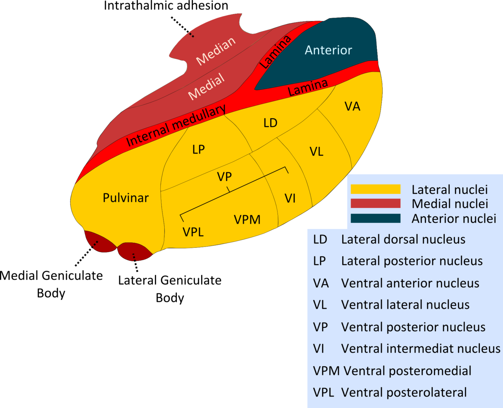

<table>
   <tr align="center">
    <td width="10%">Area<td width="65%">Description<td width="15%">Input<td width="10%"> Output</td>  
  <tr>
    <td>VPL (Ventral posterolateral nucleus)
    <td>
      
The VPL receives information from the <a href="https://en.wikipedia.org/wiki/Nociception#Neospinothalamic_tract">neospinothalamic tract</a> (+Nociception) and the medial lemniscus of the posterior column-medial lemniscus pathway. It then projects this sensory information to Brodmann's Areas 3, 1 and 2 in the postcentral gyrus. Collectively, <a href="https://en.wikipedia.org/wiki/Postcentral_gyrus#Brodmann_areas_3.2C_1_and_2">Brodmann areas 3, 1 and 2</a> make up the primary somatosensory cortex of the brain (<a href="https://en.wikipedia.org/wiki/Ventral_posterolateral_nucleus">LINK</a>)
    <td>
      <li>The neospinothalamic tract
      <li>the medial lemniscus of the posterior column-medial lemniscus pathway
    <td>Primary somatosensory cortex
  <tr>
    <td>VPM (Ventral posteromedial nucleus)
    <td>
      
The VPM contains synapses between second and third order neurons from the anterior (ventral) trigeminothalamic tract and posterior (dorsal) trigeminothalamic tract. These neurons convey sensory information from the face and oral cavity. Third order neurons in the trigeminothalamic systems project to the postcentral gyrus. 
      
The VPM also receives taste afferent information from the solitary tract and projects to the cortical gustatory area (<a href="https://en.wikipedia.org/wiki/Ventral_posteromedial_nucleus">LINK</a>)
    <td>
      <li>The face and oral cavity
      <li>Taste afferent information from the solitary tract
    <td>Primary somatosensory cortex
             
  <tr>
    <td>VA (Ventral anterior nucleus)
    <td>
The ventral anterior nucleus receives neuronal inputs from the basal ganglia. Its main afferent fibres are from the globus pallidus. The efferent fibres from this nucleus pass into the premotor cortex for initiation and planning of movement. 
      
It helps to function in movement by providing feedback for the outputs of the basal ganglia (<a href="https://en.wikipedia.org/wiki/Ventral_anterior_nucleus">LINK</a>).
    <td> 
      <li>Basal ganglia (globus pallidus)
    <td>Premotor cortex 

  <tr>
    <td>VL (Ventral lateral nucleus)
    <td>
It receives neuronal inputs from the basal nuclei which includes the substantia nigra and the globus pallidus (via the thalamic fasciculus). It also has inputs from the cerebellum (via the dentatothalamic tract).
      
It sends neuronal output to the primary motor cortex and premotor cortex.
      
The ventral lateral nucleus in the thalamus forms the motor functional division in the thalamic nuclei along with the ventral anterior nucleus. The ventral lateral nucleus receives motor information from the cerebellum and the globus pallidus. Output from the ventral lateral nucleus then goes to the primary motor cortex. 
      
The function of the ventral lateral nucleus is to target efferents including the motor cortex, premotor cortex, and supplementary motor cortex. Therefore, its function helps the coordination and planning of movement. It also plays a role in the learning of movement (<a href="https://en.wikipedia.org/wiki/Ventral_lateral_nucleus">LINK</a>).
    <td> 
      <li>Substantia nigra (SN) (via the thalamic fasciculus)
      <li>Globus pallidus (GP) (via the thalamic fasciculus)
      <li>Cerebellum (via the dentatothalamic tract)
    <td>
      <li>Primary motor cortex
      <li>Premotor cortex
</table>

#### Input/output projections from the table above. 

Saggital view
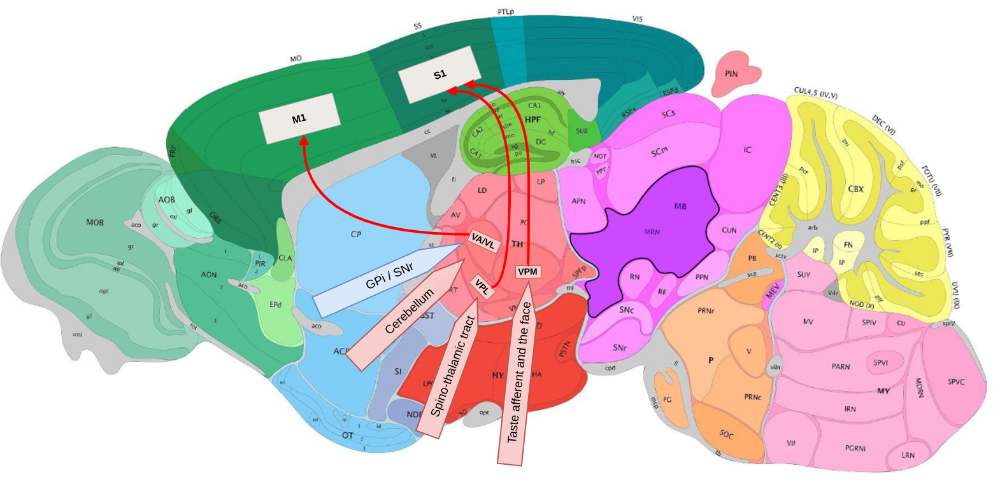

Coronal view. More schematic.
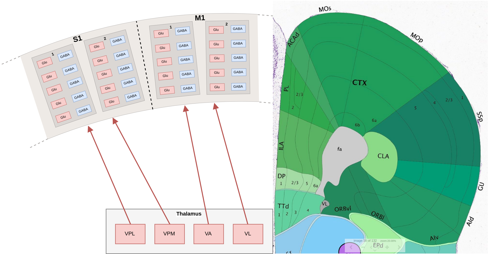

## Striatum

#### Striatal inputs and outputs conform to a dorsolateral-to-ventromedial gradient

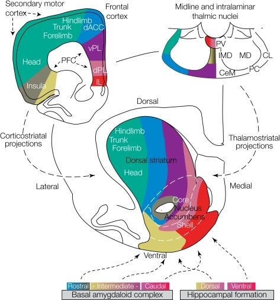

Cortical and thalamic inputs to the striatum distribute in dorsomedial-to-ventrolateral zones. The topographical arrangement of striatal afferents originating in the frontal cortex (upper left), midline and intralaminar thalamic nuclei (upper right), basal amygdaloid complex (lower left) and hippocampal formation (lower right) are illustrated. All these excitatory striatal afferent projections are strictly topographically organized. Thus, longitudinal striatal zones with a slightly oblique dorsomedial-to-ventrolateral orientation receive converging inputs from specific cortical areas that are, in turn, mostly interconnected through corticocortical fibers. 

Frontal cortical areas and their corresponding striatal projection zones are shown in the same colors. 

The dorsolateral striatum receives somatotopically organized sensorimotor information (green), the most ventromedial part of the striatum collects viscerolimbic cortical afferents (red and pink), and striatal areas between these extremes receive information from higher associational cortical areas (blue and purple). Note that the topographical organization in the corticostriatal projections is the leading organizational principle, but thalamic and amygdaloid afferents nicely match this functional–anatomical organization. 

In the figure above, the individual midline and intralaminar nuclei (upper right) are identified with different colors that match those used for the frontal cortical areas and the striatal zones to which they project. Thus, the midline paraventricular nucleus (red and pink), belonging to a group of viscerolimbic midline thalamic nuclei, projects to the ventromedial striatum. At the other extreme, the posterior and lateral intralaminar thalamic nuclei (green and blue) are **associated with primary motor functions** and project to the dorsolateral aspects of the striatum. 

More ventrally and medially located intralaminar thalamic nuclei (purple and yellow), probably **subserving polymodal sensory** and cognitive functions, project onto longitudinally oriented striatal zones intermediate between the two extremes, matching the corticostriatal zones. 

Similarly, the amygdalostriatal projections exhibit a mediolateral organization (color coding at bottom left). Caudal basal amygdaloid nuclei (red and pink), associated with viscerolimbic functions, project most medially, whereas nuclei of the rostral basal amygdaloid complex (yellow) send their fibers more laterally in the striatum. Thus, amygdaloid fibers reach in a topographical way virtually the entire striatum, the most dorsolateral sensorimotor part being only very sparsely innervated. Frontal cortical, amygdaloid and midline and intralaminar projections to the striatum are arranged such that multiple interconnected networks exist between specific frontal cortical areas and distinct amygdaloid and thalamic nuclei that converge onto the same striatal region. 

Finally, the hippocampal formation (in particular the subiculum and the CA1 region) projects to the most ventral parts of the striatum, specifically to the medial, ventral and rostral shell, as well as to the immediately adjacent parts of the core. As indicated in the lower right corner, neurons of the dorsal (yellow and pink) and ventral (pink and red) hippocampus project laterally and medially, respectively. 

Abbreviations: 

* ac, anterior commissure; 
* ACd, dorsal anterior cingulate cortex; 
* AId, dorsal agranular insular cortex; 
* AIv, ventral agranular insular cortex; 
* CeM, central medial thalamic nucleus; 
* CL, central lateral thalamic nucleus; 
* IL, infralimbic cortex; 
* IMD, intermediodorsal thalamic nucleus; 
* MD, mediodorsal thalamic nucleus; 
* PC, paracentral thalamic nucleus; 
* PFC, prefrontal cortex; 
* PLd, dorsal prelimbic cortex; 
* PLv, ventral prelimbic cortex; 
* PV, paraventricular thalamic nucleus; 
* SMC, sensorimotor cortex. 

## References

The initial ideas could be found in [memristive_approach.md](memristive_approach.md).

[Pieter Voorn et al., 2004]: http://www.cell.com/trends/neurosciences/fulltext/S0166-2236(04)00190-0
[Ferrucci et al., 2013]: https://www.ncbi.nlm.nih.gov/pmc/articles/PMC3580794/
[Crestani et al., 2013]: https://www.ncbi.nlm.nih.gov/pubmed/23997750
[Ordway et al., 2007]: http://www.cambridge.org/catalogue/catalogue.asp?isbn=9781107407411&ss=fro
[Berridge & Waterhouse, 2003]: http://citeseerx.ist.psu.edu/viewdoc/download?doi=10.1.1.204.1902&rep=rep1&type=pdf
[Aston-Jones, 2002]: https://www.google.ru/url?sa=t&rct=j&q=&esrc=s&source=web&cd=7&ved=0ahUKEwiT3LOemeTWAhWJ6RQKHaPEA2sQFghMMAY&url=https%3A%2F%2Fwww.acnp.org%2Fasset.axd%3Fid%3D13f2084e-4c46-4c48-a0e2-477f9dc2addd&usg=AOvVaw2g5YVjCzPniOlRNFEVSFMU

[Müller & Jacobs, 2010]: https://www.elsevier.com/books/handbook-of-the-behavioral-neurobiology-of-serotonin/muller/978-0-12-374634-4
[Daw et al., 2002]: https://www.ncbi.nlm.nih.gov/pubmed/12371515

Pieter Voorn, Louk J.M.J Vanderschuren, Henk J GroenewegenEmail the author Henk J Groenewegen, Trevor W Robbins, Cyriel M.A Pennartz. (2004). Putting a spin on the dorsal–ventral divide of the striatum. Volume 27, Issue 8, p468–474. http://www.cell.com/trends/neurosciences/fulltext/S0166-2236(04)00190-0

Müller, C. P., & Jacobs, B. L. (Eds.). (2010). Handbook of the behavioral neurobiology of serotonin (1st ed.. Number 21 in Handbook of Behavioral Neuroscience (1st ed.). Amsterdam: Elsevier/Academic Press. https://www.elsevier.com/books/handbook-of-the-behavioral-neurobiology-of-serotonin/muller/978-0-12-374634-4

Daw, N. D., Kakade, S., & Dayan, P. (2002). Opponent interactions between serotonin and dopamine. Neural Networks, 15(4), 603–616. https://www.ncbi.nlm.nih.gov/pubmed/12371515

Ferrucci, M., Giorgi, F. S., Bartalucci, A., Busceti, C. L., & Fornai, F. (2013). The effects of locus coeruleus and norepinephrine in methamphetamine toxicity. Current Neuropharmacol, 1(11), 80–94. https://www.ncbi.nlm.nih.gov/pmc/articles/PMC3580794/

Crestani, C. C., Alves, F. H., Gomes, F. V., Resstel, L. B., Correa, F. M., & Herman, J. P. (2013). Mechanisms in the bed nucleus of the stria terminalis involved in control of autonomic and neuroendocrine functions: A review. Current Neuropharmacol, 2(11), 141–159. https://www.ncbi.nlm.nih.gov/pubmed/23997750

Ordway, Gregory A., Schwartz, Michael A., & Frazer, A. (2007). Brain norepinephrine: Neurobiology and therapeutics. New York: United States of America by Cambridge University Press. http://www.cambridge.org/catalogue/catalogue.asp?isbn=9781107407411&ss=fro

Berridge, Craig W., & Waterhouse, B. D. (2003). The locus coeruleusnoradrenergic system: Modulation of behavioral state and state-dependent cognitive processes. Brain Research Reviews (42), 33–84. http://citeseerx.ist.psu.edu/viewdoc/download?doi=10.1.1.204.1902&rep=rep1&type=pdf

Aston-Jones, G. (2002). Norepinephrine. Pennsylvania: University of Pennsylvania School of Medicine. https://www.google.ru/url?sa=t&rct=j&q=&esrc=s&source=web&cd=7&ved=0ahUKEwiT3LOemeTWAhWJ6RQKHaPEA2sQFghMMAY&url=https%3A%2F%2Fwww.acnp.org%2Fasset.axd%3Fid%3D13f2084e-4c46-4c48-a0e2-477f9dc2addd&usg=AOvVaw2g5YVjCzPniOlRNFEVSFMU

Tsai, D., John, E., Chari, T., Yuste, R., & Shepard, K. (2015). High-channel-count, high-density microelectrode array for closed-loop investigation of neuronal networks. In Engineering in Medicine and Biology Society (EMBC), 2015 37th Annual International Conference of the IEEE (pp. 7510–7513). IEEE. Retrieved from http://ieeexplore.ieee.org/abstract/document/7320129/

Fontana, M. P., & Erokhin, V. (2011). Thin Film Electrochemical Memristive Systems for Bio-Inspired Computation. Journal of Computational and Theoretical Nanoscience, 8(3). https://doi.org/10.1166/jctn.2011.1695

Feldmeyer, D. (2012). Excitatory neuronal connectivity in the barrel cortex. Frontiers in Neuroanatomy, 6. https://doi.org/10.3389/fnana.2012.00024

Meyer, H. S., Wimmer, V. C., Oberlaender, M., de Kock, C. P. J., Sakmann, B., & Helmstaedter, M. (2010). Number and Laminar Distribution of Neurons in a Thalamocortical Projection Column of Rat Vibrissal Cortex. Cerebral Cortex, 20(10), 2277–2286. https://doi.org/10.1093/cercor/bhq067

V. B. Mountcastle, “An organizing principle for cerebral function: the unit module and the distributed system,” in The Mindful Brain: Cortical Organization and the Group-Selective Theory of Higher Brain Function, G. M. Endelman and V. B. Montcastle, Eds., pp. 7–51, MIT Press, Cambridge, Mass, USA, 1978.

