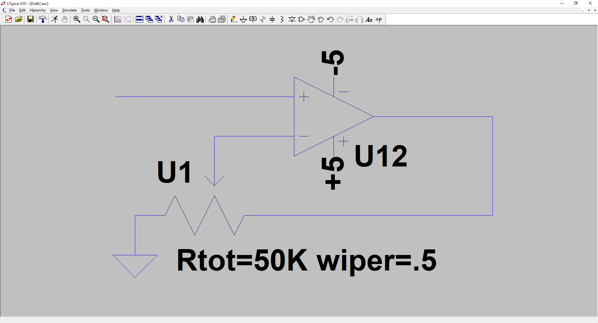

# Equipment used

Type | Model
------------ | -------------
Oscilloscope | Tektronix TDS 2024C 
Waveform generator | АКИП 3407/1А 
Multimeter | Pro'sKit MT-1270 
DC Power Supply | Gw INSTEK GPS-74303 

# Components used

Type | Model
------------ | -------------
Operational Amplifier | [TI LM2902](http://www.ti.com/lit/ds/symlink/lm2902.pdf)
Diode | [1N4148](https://www.vishay.com/docs/81857/1n4148.pdf)
Transistor | [BC547B](https://www.farnell.com/datasheets/410427.pdf)

Amplifier made on OpAmp U12 on schematic uses 4-pin varisors, substracting schematic on OpAmp U14 and V6 voltage generator to simulate modulator level.
In real schema 50K potentiometer used as a amplifier gain control, as in [explanatory picture](Pot_replacement.png)

